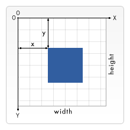

# Canvas API

Default Size is 300 x 150 pixel, Blank, Transparent

```html
<canvas id="canvas" width="150" height="150"></canvas>
```

### Set any fallback content

```html
<!-- Image will be dispalyed, If canvas failed to load -->
<canvas id="canvas" width="150" height="150">
	
</canvas>
```

```js
const canvas = document.getElementById("canvas");
const ctx = canvas.getContext("2d");
// WebGL for 3D ctx
if (ctx) {
	// drawing code here
} else {
	// canvas-unsupported code here
}
```

### Canvas Grid

<div align="center">
  
</div>

### Drawing Shapes (Rectangles and paths are only two primitives)

#### Drawing rectangles

```js
fillRect(x, y, width, height); // Filled rectangle
strokeRect(x, y, width, height); // Rectangular outline
clearRect(x, y, width, height); // Make area transparent
```

x, y top-left position (Relative to the canvas origin(0, 0))

### Drawing paths

```js
// Context Methods
beginPath(); // Creates a new path. Once created, future drawing commands are directed into the path
moveTo(x, y); // Start Position, Move the pen
lineTo(x, y); // Draws a line from the current drawing position to the position specified by x and y
stroke(); // Draws only path's outline.
fill(); // Filling the path's area and close shape automatically.
closePath(); // Draws a straight line from the current point to the start.

rect(x, y, width, height); // Draws a rect in current path
// moveTo(x, y) automatically;

arc(x, y, radius, startAngle, endAngle, counterclockwise);
// center (x, y), Angle-radian, counterclockwise-boolean

arcTo(x1, y1, x2, y2, radius);
// arc from (x1, y1) to (x2, y2)

quadraticCurveTo(cp1x, cp1y, x, y); // 1 control points
// Draws a quadratic Bézier curve from the current pen position to the end point specified by x and y, using the control point specified by cp1x and cp1y.

bezierCurveTo(cp1x, cp1y, cp2x, cp2y, x, y); // 2 control points
// Draws a cubic Bézier curve from the current pen position to the end point specified by x and y, using the control points specified by (cp1x, cp1y) and (cp2x, cp2y).
```

<div align="center">
  
</div>
